加油，8班的同学！王志军！

# 1 终值

## 1.1 什么终值？

现值：未来一期或若干期后的一笔资金，其现在的价值。

​	PV：现值  present value
​	FV：终值 
​	r：利率（通常指年利率）

## 1.2 终值公式

公式为：    $$ PV= \frac{FV}{1+r}  $$

终值的计算：货币时间价值一般是按**复利**计算的。

假如现在有100元，年复利率为10%，则从第一年到第n年各年末的终值为：

​	第1年的终值： $$S=100\times({1+10\%})=110$$元

​	第2年的终值： $$S=110\times({1+10\%})=100\times({1+10\%})^2$$元

​	依次类推......

第n年的终值：$$S=100\times({1+10\%})^t$$

复利**终值**的计算公式：

​	$$S=P\times({1+r})^t=p\times({S/p,r,t})$$

## 1.3 例题

**例1：**某人将100元存入银行，利率为10%，每年按复利计息，5年后他能得到多少钱？

​		$$S=100\times({1+10\%})^5=100\times({S/P,10\%,5})$$

​			$$=100\times1.6105=161.05（{元}）$$

**例2：**某人购买3年期按复利计算的债券5000元，年利 率为14%，问3年后一次可取出多少钱？

​		$$S=5000\times({S/P,15\%,3})$$

​			$$=5000\times1.4815=7407.5$$

# 2 现值

## 2.1 什么是现值？

​		已知终值求现值，称为“折现”（Discounting），它是复利(Compounding)的相反过程。所用的利率叫**贴现率**

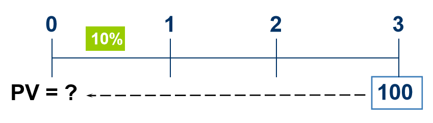

## 2.2 现值公式

S   ：终值

PV：现值

r   ：利率

​		$$S=P\times({1+r})^t$$    可求现值 $${PV}$$

​		$$PV=S\times[{\frac{1}{({1+r})^t}}]=S\times(P/S,r,t)$$

## 2.3 例题

**例1** 某人5年后将收到1万元款项。此人可以以5%的回报率进行投资。那么他未来1万元现金流的现值是多少了？

​		$$PV=10000\times(P/S,5\%,5)$$

​		$$=10000\times0.7835=7835(元)$$

# 3 普通年金

## 3.1 什么是年金？

**年金**：每年（期）收（或付）一笔相同金额的一系列。

**特点**：1，多笔收或付；2，每笔等额；

折旧、租金、保险费、贷款的分期付款等通常表现为年金形式。

$$ 年金= \begin{cases} 后付年金（普通年金）\\ 预付年金（先付年金、既付年金） \\ 递延年金  \\永续年金 \\永续增长年金 \end{cases} $$

## 3.2 普通年金

​		普通年金：各期期末收付的年金；

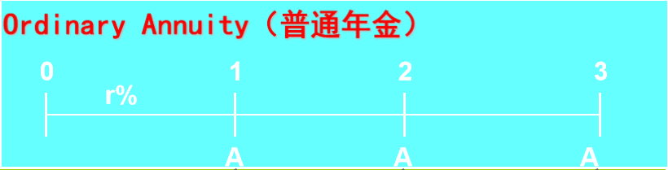

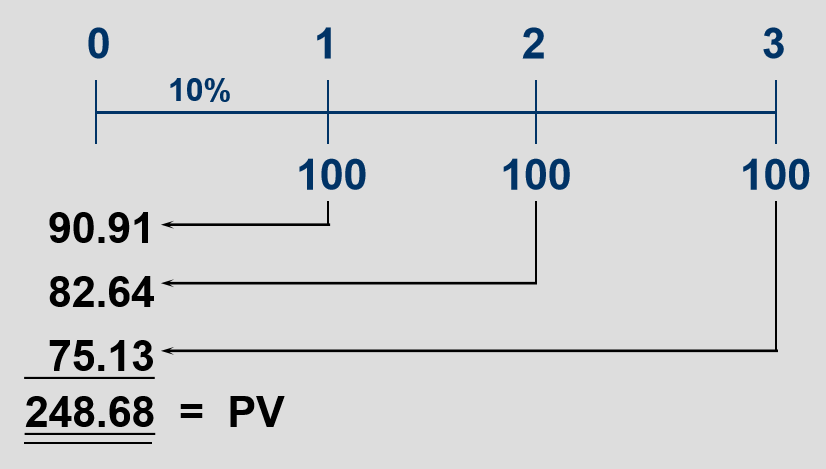

​		普通年金的现值PV：

​		$$PV=A\times\frac{1-(1+r)^{-t}}{r}=A\times(P/A,r,t)$$

## 3.3 例题

> 后面的例题要查询【复利年金现值系数表】

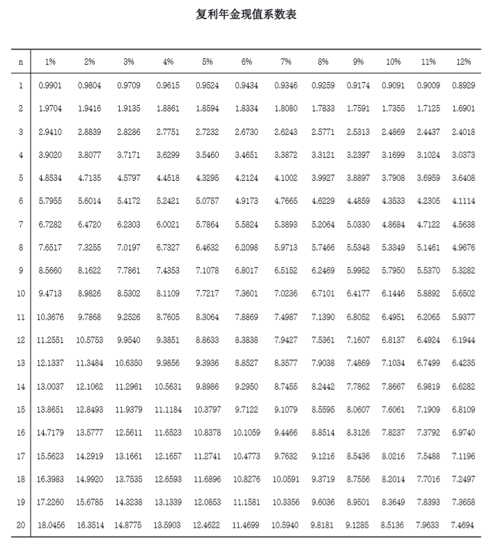

### 3.3.1 例1

​		某企业拟租入一设备，每年 要支付租金 10000元，设银行利率为10%，则5 年中租金的 为：

​		$$PV=10000\times(P/A,10\%,5)$$

​		$$=10000\times3.7908=37908(元)$$

### 3.3.2 例2

​		ABC公司以分期付款方式向XYZ公司出售一台大型 设备。合同规定XYZ公司在10 年内每半年支付5 000元欠款。 ABC公司为马上取得现金，将合同向银行折现。假设银行愿 意以14%的名义利率、每半年计息一次的方式对合同金额进行 折现。则这笔金额的现值是多少？ 

​		因为年利率为14%，所以半年利率为7%

​		$$P=5000\times[\frac{1-(1+7\%)^{-20}}{7\%}]$$

​			$$=5000\times(P/A,7\%,20)$$

​			$$=52970(元)$$

### 3.3.3 例3

​		Mark Young赢得了一项州博彩大奖，在以后20年中每年将得到50000美元的奖金，一年以后开始领取奖金。博彩公司的广告称这是一个百万美元的大奖。若年利率为8%，这项奖项真实一个百万美元的大奖吗？

​		$$PV=\$50,000\times(P/A,8\%,20) $$

​				$$ =\$50,000\times9.8181$$

​				$$=\$490,905$$

# 4 预付年金

## 4.1 预付年金

1. 预付年金：各期期初收付的年金；

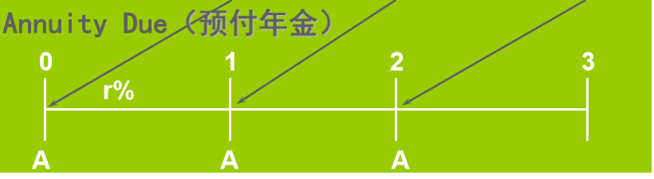

## 

​		$$PV=后付年金的现值\times(1+i)$$

​				$$A\times(P/A,r,t)\times(1+r)$$

​				或

​				$$PV=A\times[(P/A,r,t-1)+1]$$

**换算口诀**：期数减1，系数加1

## 4.2 例题

​		Mark Young赢得了一项州博彩大奖，在以后20年中每年将得到50000美元的奖金，**马上**以后开始领取奖金。博彩公司的广告称这是一个百万美元的大奖。若年利率为8%，这项奖项真实一个百万美元的大奖吗？

​		$$PV=\$50,000\times[(P/A,8\%,20-1)+1] $$

​				$$ =\$50,000\times[9.604+1]$$

​				$$=\$530200$$

# 5 永续年金

## 5.1 什么是永续年金

**永续年金**：无限期支付的年金

​		例如：优先股的股利、英国的金边债券、统一公债

​		$$P=\frac{A}{r}$$

## 5.2 例题

### 5.2.1 优先股

​		假设一优先股，每年分得股息10元，而年利率为6%，问：该优先股出售价格为多少元，投资人才肯购买？

​			$$P=\frac{A}{r}=\frac{10}{6\%}=166.67(元)$$

### 5.2.2 善变的慈善家1

​		某位可敬的慈善家打算捐赠某个商学院一个研究职位，如果他想在10%的利率条件下今后每年都能提供10万元，那么他现在需要划拨的资金应该是多少?

​			$$PV=\frac{A}{r}=\frac{10}{10\%}=100（万元）$$

## 5.3 永续增长年金

**现值**    $$PV=\frac{C_1}{r-g}$$

​		$$C_1$$：现在开始一期后收到的现金流

​		g   ：每期的增长率

​		r	：年利率

### 5.3.1 善变的慈善家2

​		某位可敬的慈善家打算捐赠某个商学院一个研究职位，如果他想在10%的利率条件下今后每年都能提供10万元，但是薪水可能每年增长4%，那么慈善家希望每年提供的善款都能跟上薪水增长的节奏，那么他现在必须划拨的资金是多少？

​			$$PV=\frac{C_1}{r-g}=\frac{10}{0.10-0.04}=166.67$$

# 6 净现值（NPV）

## 6.1 什么是净现值？

$$NPV（net \; present\; value）=资产的市场价值-成本$$

​		或者

$$NPV（net \;present \;value）=现金流入量现值-现金流出量现值$$

### 6.1.1 例1

​		假如打算投资建造一座办公大楼，其现金预算如下，如果利率为7%，你应该将此项目进行下去吗？

|           时间           |    t=0    |    t=1    |    t=2    |
| :----------------------: | :-------: | :-------: | :-------: |
|           土地           |  -50000   |           |           |
|          建设费          |  -100000  |  -100000  |  -100000  |
| 收入（完工后楼盘的价值） |           |           |  +400000  |
|           合计           | c=-150000 | c=-100000 | c=+300000 |

### 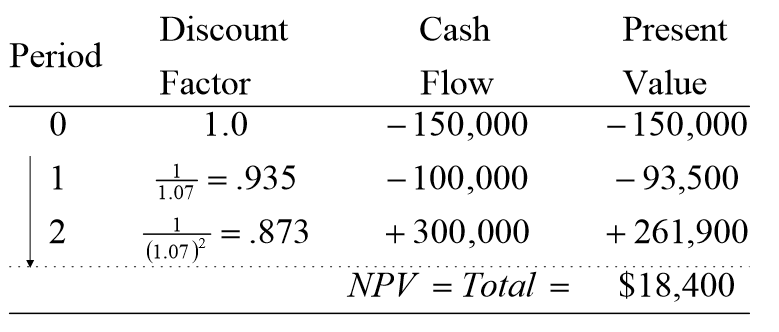

### 6.1.2 例2

​		太平洋海岸资源公司正致力于在西雅图建造一个集装箱装载码头，有关现金流量如下表（单位：百万美元）。假设该公司有其他产生10%年利率的投资机会，公司是否应对该码头进行投资？

|  年  |    0    |  1   |  2   |  3   |  4   |  5   |  6   |  7   |  8   |  9   |  10  |
| :--: | :-----: | :--: | :--: | :--: | :--: | :--: | :--: | :--: | :--: | :--: | :--: |
|  CF  | （$40） | 7.5  | 7.5  | 7.5  | 7.5  | 7.5  | 7.5  | 7.5  | 7.5  | 7.5  | 7.5  |

​		$$NPV（net \;present \;value）=现金流入量现值-现金流出量现值$$

​		集装箱装载码头的$$NPV=4975.5-4000=975.5(万美元)$$

​		因为NPV为正值，因此该公司可以进行投资，因为4000万美元换回来4975.5万美元，是赚钱的。

## 6.2 净现值与价值创造

​		$$NPV>0时，接受投资方案$$

​		$$NPV<0时，拒绝投资方案$$

​		$$NPV=0时，投资方案两可$$

如何评估一个公司的价值？

# 7 证券估价

**注意**：证券股价感觉表述的问题，因为证券估价就一个原理，课件讲的更多的是债券估价

> 证券/资产的价值：未来现金流入量的现值

证券估价是公司理财的一个重要内容，其基本目的为：

1. 判断证券价值在市场上是否得到充分显示

2. 判断公司理财目标--企业价值最大化的实现程度

   

证券估价的基本原理：

​			$$V=\sum_{t=1}^n\frac{CI_t}{(1+r)^t}$$

老师的课件真的这有这么一点，所以我补充了债券股价，我害怕本应该是债券估价

# 7 债券估计

## 7.1 估价模型

### 7.1.1 公式

债券内在价值：预期现金流量的现值

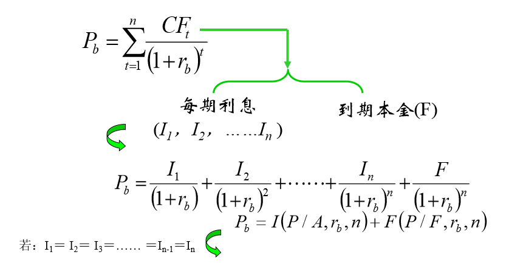

### 7.1.2 XYZ公司债券价值

​		假设XYZ公司5年前发行一种面值为1000元的25年期债券，息票率为11%。同期债券目前的收益率为8%。假如每年付息一次，XYZ公司债券价值是多少？

​	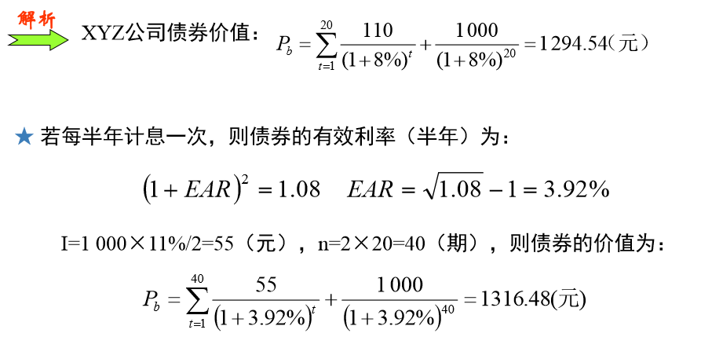

## 7.2 可赎回债券估价模型

### 7.2.1 公式

### 7.2.2 ABC公司

​		ABC公司拟发行债券筹资，债券面值为1 000元， 息票率为12%，期限为20年，每年付息一次，到期偿还本金。 债券契约规定，5年后公司可以1 120元价格赎回。目前同类 债券的利率为10%，分别计算债券被赎回和没有被赎回的价值。 

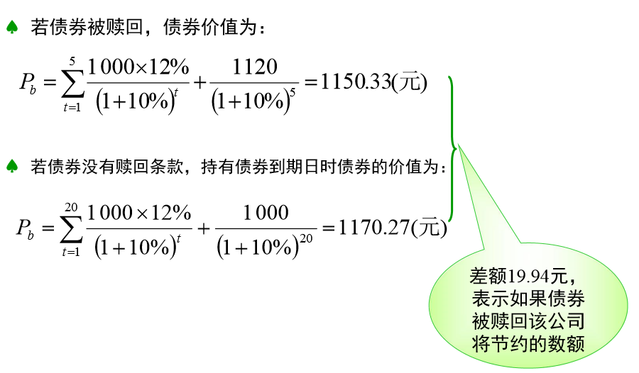

# 8 收益率估价模型

## 8.1 债券到期收益率

债券到期收益率：债券按当前市场价值购买并持有至到期日所产生的预期收益率；

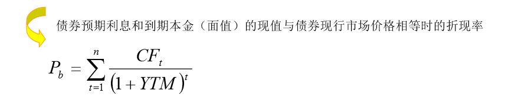

**例题：**假设你可以1 050元的价值购进15年后到期，票面利 率为12%，面值为1 000元，每年付息1次，到期1次还本的某 公司债券。如果你购进后一直持有该债券直至到期日，要求 计算债券的到期收益率。 

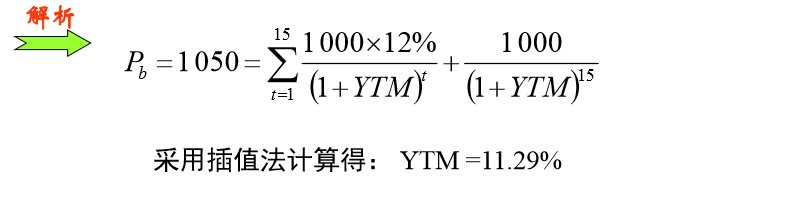

## 8.2 赎回收益率

假设你可以1 050元的价值购进15年后到期，票面利 率为12%，面值为1 000元，每年付息1次，到期1次还本的某 公司债券。债券按面值发行，如果5年后市场利 率下降到8%，债券一定会被赎回，那么债券赎回时的收益率计 算如下： 

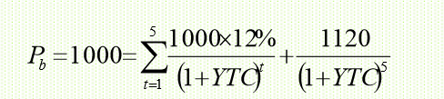

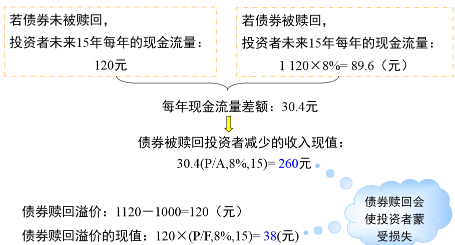

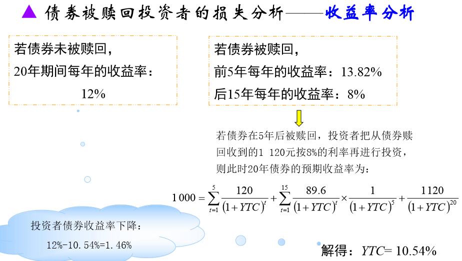

## 8.3 （期间）收益率

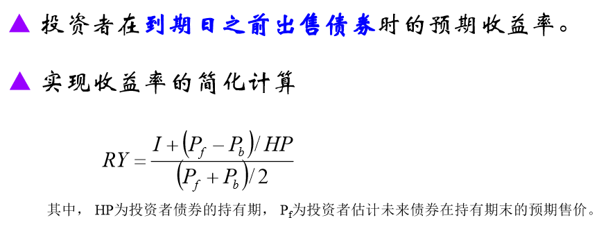

例题：假设你以1 170.27元的价格购买了息票率为12%的20 年期债券，其YTM为10%。基于对经济形势和资本市场的分析， 你预期5年后该债券的YTM将下降至8%，如果这个判断是正确 的，你希望计算5年后该债券的未来价格(Pf)，以估计预期收益 率。假设估计的持有期为5年，这意味着剩余年限为15年，如 果市场利率为8%，试计算债券第5年末价格。

​		该债券的未来价格：

# 9 股票折现

股票价值等于其未来现金流量的现值。 

​		$$P_0=\sum_{t=1}^{n}\frac{CF_t}{(1+r_s)}$$

- 现金流量：股利或股权自由现金流量
- 折现率：股票投资者要求的收益率或股权资本成本

股票价值等于其未来现金流量的现值

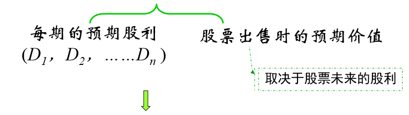

​	                   	$$P_0=\frac{D_1}{(1+r_s)}+\frac{D_2}{(1+r_s)^2}+....=\sum_{t=1}^{\infty}\frac{D_t}{(1+r_s)^t}$$

（1）股利折现法适用情况:

​		现金流量相对确定的资产（如公用事 业），特别适用于当前处于早期发展阶段， 并无明显盈利或现金流量，但具有可观增长 前景的公司。

（2）股利折现法的局限性

​		估价结果取决于对未来现金流量的预测 以及对与未来现金流量风险特性相匹配的折 现率的估计，当实际情况与假设的前提条件 有差距时，就会影响估价结果的可信度。

## 9.1 股利零增长模型 

预期股利增长率为零，即公司每期发放的股利（D）相等

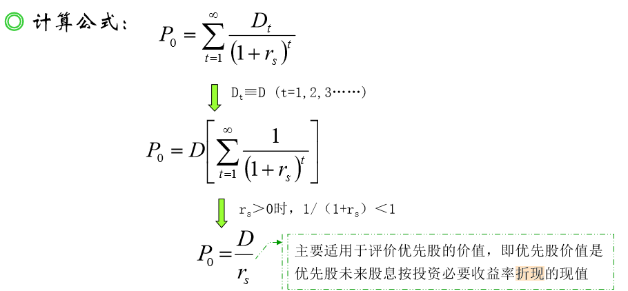

股票（优先股）收益率：股息与其市场价值之比 

​									$$r_s=\frac{D}{P_0}$$

## 9.2 股利稳定增长模型

假设条件：

​					（1）股利支付是永久性的，即t→∞

​					（2）股利增长率为一常数(g)，即$$g_t=g;$$

​					（3）模型中的折现率大于股利增长率，即$$r_s > g$$ 

计算公式：

​						$$P_0=\frac{D_0\times(1+g)}{r_s-g}=\frac{D_1}{r_s-g}$$

​		**例1：**假设一个投资者正考虑购买ACC公司的股票，预期1 年后公司支付的股利为3元/股，该股利预计在可预见的将来以 每年8%的比例增长，投资者基于对该公司风险的评估，要求 最低获得12%的投资收益率，据此计算该公司的股票价格。 

​							ACC公司股票价格为：

​									$$P_0=\frac{3}{12\%-8\%}=75(元)$$

**1，股票预期收益率**

​		**例2：**假设ACC公司股票现时售价75元，投资者预 期在下一年收到现金股利3元，预期一年后股票出售价格为81 元，那么，股东的预期收益率为：

​					预期收益率	$$=\frac{3}{75}+\frac{81-75}{75}=4\%+8\%=12\%$$

​		若已知股票市场价格（$$P_0=75$$）、预期股利（D1=3）及股利增长率 （g=8%），则股票预期收益率：

​					预期收益率	$$=\frac{D_1}{P_0}+g=\frac{3}{75}+8\%=12\%$$

**2，增长机会** 

- 公司收益增长率大于股利支付率
- 公司将收益的一部分转化为新项目投资

计算公式：

​					$$P_0=\frac{EPS_1}{r_s}+PVGO$$

1，$$\frac{EPS_1}{r_s}$$：公司现存资产创造的收益的现值，即公司把所有的收益都分配给投资者时的股票价值；

2，$$PVGO$$：增长机会收益现值，即公司留存收益用于再投资所带来的新增价值；

​		**ACC公司为一增长型公司**

​		**例3：**假设ACC公司每年将收益的40%用于再投资，第1年再投资 额为2元（5×40%），假设再投资收益率为20%，从第2年开始每年收益为 0.4元（2×20%），按永续年金计算，第1年再投资获得的收益现值为3.33元 （0.4÷12%），归属于股东的增量现金流量（净现值）为1.33元(3.33-2)。

​		未来各年投资机会现值： 

​									$$PVGO=\frac{1.33}{12\%-8\%}=33.33（元）$$

​		ACC公司价值等于现有资产创造的价值和未来投资机会的价值之和 

​									$$P_0=\frac{5}{12\%}+\frac{1.33}{12\%-8\%}=41.67+33.33=75(元)$$

​		**ACC公司为一维持型公司**：公司每年的投资仅用来更新已损耗的设备，即维持原有的 生产能力不变，这样公司未来净投资为零，未来增长机会的现 值也为零。 

​		**例4：**假设该公司以后各期股票的每股收益均为5元， 且全部用于股利发放，假设投资必要收益率为12%。

​		公司目前股票价值：

​						$$P_0=\frac{EPS_1}{r_s}=\frac{5}{12\%}=41.67(元)$$

​		**ACC公司为一收益型公司** 

​		**例5：**公司收益中的40%用于再投资，但新投资的预 期收益率与公司必要收益率（12%）相同。 在其他因素不变 的情况下，根据股利稳定增长模型，ACC公司的收益增长率 （即股利增长率）为: 

​													$$40\%\times12\%=4.8\%$$

​					则股票价值为：	$$P_0=\frac{3}{12\%-4.8\%}=41.67(元)$$

## 9.3 总结

### 9.3.1 收益型或维持型股票

​				$$NPVGO=0,P_0=\frac{EPS_1}{r_s}$$

​		**特点：**公司现时没有大规模的扩张性资 本支出，成长速度较低；内部产生的经营 现金流量可以满足日常维护性投资支出的 需要，财务杠杆比较高；现金流入和现金 股利支付水平较为稳定，且现金股利支付 率比较高。

### 9.3.2 增长型股票

​			$$NPVGO>0,p_0>\frac{EPS_1}{r_s}$$

​		**特点：**公司通常具有较好的投资机会， 处于大规模投资扩张阶段，公司收益主要 用于再投资，并且需要较大规模的外部筹 资；公司销售收入持续高增长；股利政策 以股票股利为主，很少甚至不发放现金股 利；长期负债率比较低

### 9.3.3 衰退型股票

​		$$NPVGO<0,P_0<\frac{EPS_1}{r_s}$$

​		**特点：**公司产品老化、市场萎缩，再投 资收益率小于资本成本；股利政策以现金 股利为主，股利支付率比较高；如果没有 “转产”的高效益投资机会，可能会考虑 “拍卖公司”以获得现金用于分配；也可 能会在市场机制作用下清算破产

# 10 市盈率?

​		市盈率（Price Earnings Ratio，简称PER），也称“本益比”，市盈率是指股票价格除以每股收益的比率。

​					$$P=\frac{EPS}{r}+NPVGO$$  可推出：

​					$$\frac{P}{EPS}=\frac{1}{r}+\frac{NPVGO}{EPS}$$

​		决定市盈率的关键：

- ​		NPVGO
- ​		r（反映股票的风险）
- ​		公司选择的会计方法

关于**市盈率**只找到这些资料，非常抱歉！

# 11 公司评价?

​		公 司的市值		$$V=预期未来自由现金流量的现值$$

​			$$=\frac{FCF_1}{(1+WACC)}+\frac{FCF_2}{(1+WACC)^2}+\frac{FCF_\infty}{(1+WACC)^\infty}$$

# 12 投资报酬率

**投资报酬率：**是投资项目寿命周期内平均的年投资 报酬率，也称为平均投资报酬率。它表示单 位投资额每年获得的报酬，是一项反映投资 获利能力的指标。

方式一：以原始投资额为基础计算投资报酬率

​				$$投资报酬率=\frac{平均每年获得的投资税后净利}{投资的初始投资额}\times100\%$$

方式二：以平均投资额为基础计算投资报酬率

​				$$平均投资报酬率=\frac{投资获得的年平均净利}{(初始投资额-残值)\div2}\times100\%$$

## 12.1 例题

​		某企业拟进行一项投资，现有两各方案可供选择，其 有关资料如下，试用投资报酬率法进行分析决策。

|       项目       | A方案 | B方案 |
| :--------------: | :---: | :---: |
|    原始投资额    | 80000 | 50000 |
|   预计终了残值   | 10000 | 6000  |
|    预计寿命期    |  10   |  10   |
| 平均每年税后净利 | 10000 | 8000  |

方法一：

A方案：  $$投资报酬率=\frac{10000}{80000}\times100\%=12.5\%$$

B方案：  $$投资报酬率=\frac{8000}{50000}\times100\%=16\%$$

​			**B方案投资报酬高，选择B方案**

方法二：

A方案：$$平均投资报酬率=\frac{10000}{(80000-10000)\div2}\times100\%=28.57\%$$

B方案：$$平均投资报酬率=\frac{8000}{(50000-6000)\div2}\times100\%=36.37\%$$

​		方法二中B方案平均投资报酬率也高于A方案， 因此也应选B方案。

## 12.2 优点

- 该指标经济意义易于理解，简便易行
- 考虑了投资寿命期内所有年份的收益情况，比回收期法客观、 全面

## 12.3 缺点

- 是一个静态评估指标，忽略了资本的时间价值。
- 使用会计上的“净利润”概念，而“净利润”与 现金流量有较大差异，因此并不能反映真实报酬率的高低

# 13 内含报酬率（IRR）

​		内含报酬率（Internal Rate of Return，IRR），也可称为内部报 酬率。IRR的定义：使投资项目的净现值等于零的贴现率。

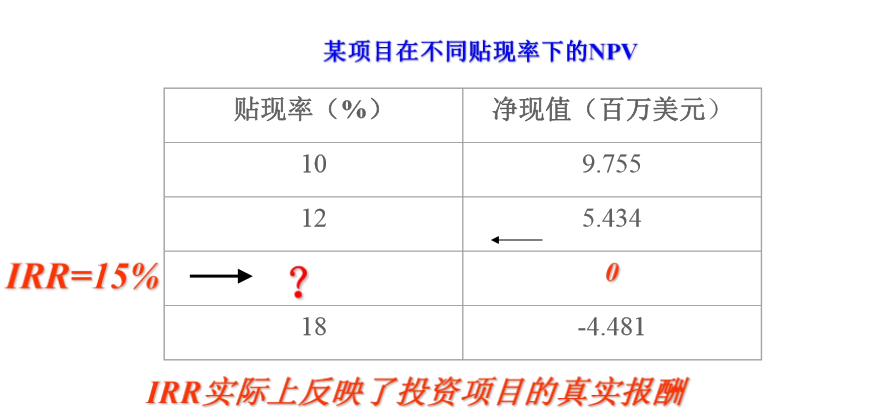

## 13.1 IRR计算公式

​						$$\sum_{t=1}^{n}\frac{NCF_t}{(1+r)^t}-c=0$$

​		$$NCF_t$$：第t年的NCF

​		  r		：内部报酬率

​		  n		：项目使用年限

​		  r		：初始投资额

​		一个投资项目的IRR在经济意义上等价于年利息率为IRR的银行 帐户。

## 13.2 计算方法

​		**（1）方案是一次性投资，且每年现金流入量相等**

​					年金现值P，年金A，时间n，求利率  $$ i=?$$

​			先计算年金现值系数		$$（P/A,i,n）=P/A$$

​			从表中查到就得到结果，日光查不到就采用插值法。

**例题：**某企业拟购置一台设备，计划投资额为200 000元，当年投 产，预计寿命期为10年，该项投资每年可取的的现金流入量为 40000元，企业投资的必要报酬率为13%，试用内含报酬率法分 析该投资方案的可行性。

​		方案的现金流量图为：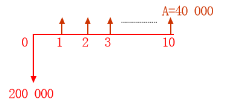

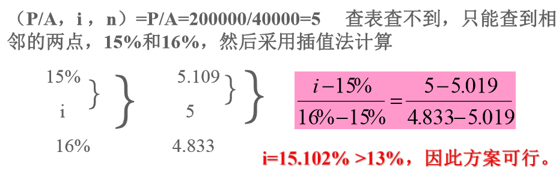

（2）方案每年的现金流入量不相等

​		内含报酬率可用 来测定，即以不同的报 酬率来逐次计算投资的净现值，直到测到净现值为零 时止，这时所采用的报酬率就时该项投资的 内含报酬率。

流程：（1）先任意估计一个贴现率，计算净现值

​			（2）如果净现值为正，说明这个贴现率偏小，应 提高贴现再次试算

​			（3）如果净现值为负，说明这个贴现率偏大，应 降低贴现率再次试算

​			（4）经过多次试算，找到净现值由正到负且比较 接近于零的两个贴现率。然后采用插值法计算出内含 报酬率。

**例题：**某企业拟购设备一台，计划投资320 000元，当 年投产，预计寿命期为4年，每年现金流入量如下表：

| 年次 | 现金流入量 |
| :--: | :--------: |
|  1   |   100000   |
|  2   |   130000   |
|  3   |   110000   |
|  4   |   70000    |

该项投资要求达到10%的报酬率，试计算其内含报酬率，并 评价是否可行？

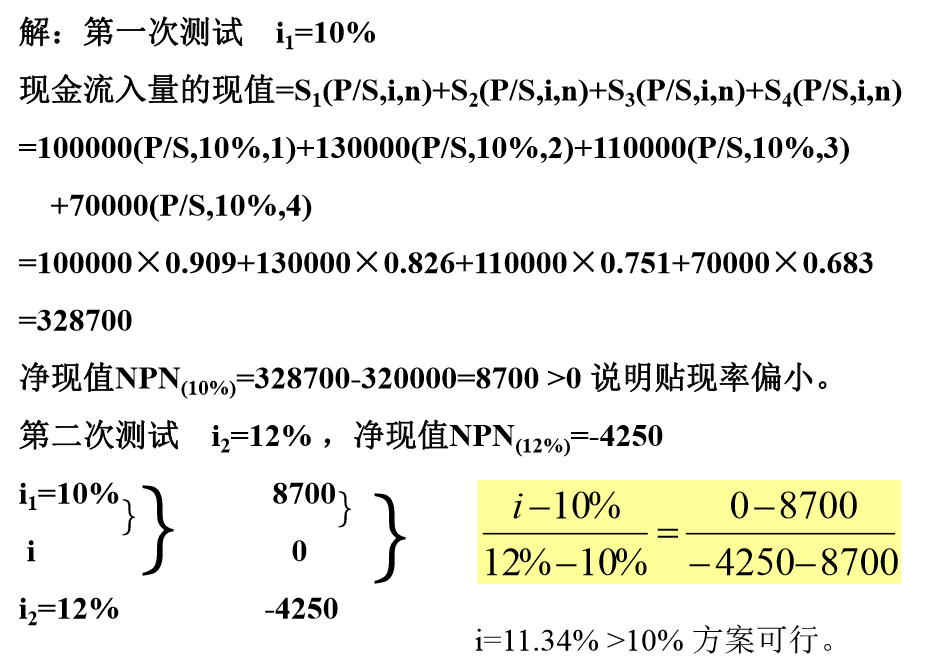

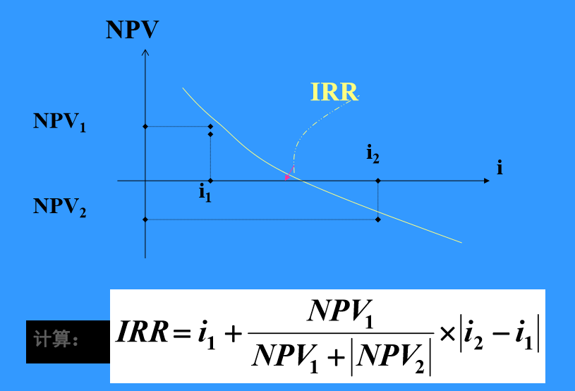

## 13.3 内部报酬率法的评价

优点：

​		1，同NPV紧密相关，通常会得到相同的结论；

​		2，容易理解和沟通；

缺陷：

​		1，投资还是融资

​		2，多个内部收益率

​		3，在对**互斥项目**进行比较时可能导致错误的决策

# 14 折旧

# 15 回收期

# 18 报酬率

# 19 盈亏平衡点